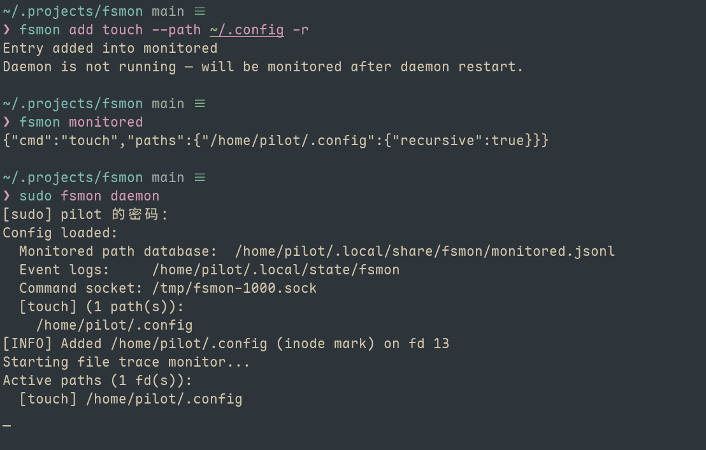

<h1 align="center">
  <samp>fsmon</samp>
</h1>

<h3 align="center">Real-time Linux filesystem change monitoring with process attribution.</h3>

🌍 **Select Language | 选择语言**
- [English](./README.md)
- [简体中文](./README.zh-CN.md)

[](https://crates.io/crates/fsmon)

<div align="center">

</div>

## Features

- **Real-time Monitoring**: Captures 14 fanotify events (default: 8 core change events, `--all-events` for all 14)
- **Process Attribution**: Tracks PID, command name, and user for every file change — even short-lived processes like `touch`, `rm`, `mv`
- **Recursive Monitoring**: Watch entire directory trees with automatic tracking of newly created subdirectories
- **Complete Deletion Capture**: Captures every file deleted during `rm -rf` via persistent directory handle cache
- **High Performance**: Rust + Tokio, <5MB memory footprint, zero-copy FID event parsing, binary-search log querying
- **Flexible Filtering**: Filter by time, size, process, user, event type, and exclude patterns (wildcards)
- **Multiple Formats**: Human-readable, JSON, and CSV output
- **TOML Configuration**: Persistent config at `~/.fsmon/config.toml` or `/etc/fsmon/config.toml`
- **Log Management**: Time-based and size-based log rotation with dry-run preview
- **Systemd Service**: Install as systemd service with configurable security hardening

## Why fsmon

Ever needed to answer "Who modified this file?" on a Linux server? That's exactly what fsmon is for.

Traditional file monitoring tools give you events without context — fsmon bridges that gap by attributing every file change to its responsible process. Whether it's a rogue script, an automated deployment, or a misconfigured service, you'll know exactly what happened, when, and who (or what) caused it.

## Quick Start

### Prerequisites

- **OS**: Linux 5.9+ (requires fanotify FID mode)
- **Tested Filesystems**: ext4, XFS, btrfs (Note: Linux 6.18+ recommended for full recursive operation support of btrfs) 
- **Build**: Rust toolchain (`cargo`)

```bash
# Verify kernel version
uname -r  # requires ≥ 5.9

# Install Rust if needed
curl --proto '=https' --tlsv1.2 -sSf https://sh.rustup.rs | sh
source $HOME/.cargo/env
```

### Installation

```bash
# Build from source
git clone https://github.com/lenitain/fsmon.git
cd fsmon
cargo install --path .

# Or install from crates.io
cargo install fsmon
```

**Important: Fanotify requires root privileges**
```bash
# Method 1: Copy to /usr/local/bin (recommended)
sudo cp ~/.cargo/bin/fsmon /usr/local/bin/

# Method 2: Use full path directly
sudo ~/.cargo/bin/fsmon monitor ... 
```

### Basic Usage

```bash
# Monitor a directory
sudo fsmon monitor /etc --types MODIFY

# Monitor with recursive watching
sudo fsmon monitor ~/myproject --recursive

# Exclude patterns
sudo fsmon monitor /var/log --exclude "*.log"

# Install as systemd service for long-term auditing
sudo fsmon install /var/log /etc -o /var/log/fsmon-audit.log

# Query historical events
fsmon query --since 1h --cmd nginx

# Clean old logs (dry-run preview)
fsmon clean --keep-days 7 --dry-run

# Check service status
fsmon status
```

## Examples

### Investigate Configuration Changes

```bash
# Monitor /etc for modifications
sudo fsmon monitor /etc --types MODIFY --output /tmp/etc-monitor.log

# In another terminal, make a change
echo "192.168.1.100 newhost" | sudo tee -a /etc/hosts

# Query the results
fsmon query --log-file /tmp/etc-monitor.log --since 1h --types MODIFY
```

### Track Large File Creation

```bash
# Watch for files larger than 50MB
sudo fsmon monitor /tmp --types CREATE --min-size 50MB --format json

# Trigger
dd if=/dev/zero of=/tmp/large_test.bin bs=1M count=100
```

### Audit Deletion Operations

```bash
# Capture complete recursive deletion
sudo fsmon monitor ~/test-project --types DELETE --recursive --output /tmp/deletes.log

# Trigger
rm -rf ~/test-project/build/

# Output shows every file deleted (even in subdirectories)
[2026-01-15 16:00:00] [DELETE] /home/pilot/test-project/build/output.o (PID: 34567, CMD: rm)
[2026-01-15 16:00:00] [DELETE] /home/pilot/test-project/build (PID: 34567, CMD: rm)
```

### Filter with Combined Criteria

```bash
# Query nginx operations in last hour, sorted by file size
fsmon query --since 1h --cmd nginx* --sort size

# Monitor only CREATE and DELETE events, exclude temp files
sudo fsmon monitor /var/www --types CREATE,DELETE --exclude "*.tmp"
```

## Command Reference

```bash
fsmon monitor --help    # Real-time monitoring with fanotify
fsmon query --help      # Query history logs with filters and sorting
fsmon clean --help      # Cleanup old logs by time or size
fsmon status            # Check systemd service status
fsmon stop              # Stop systemd service
fsmon start             # Start systemd service
fsmon install --help    # Install systemd service (auto-detects binary path)
fsmon uninstall         # Uninstall systemd service
```

## Configuration

fsmon supports TOML configuration files at `~/.fsmon/config.toml` or `/etc/fsmon/config.toml`:

```toml
[monitor]
# Paths to watch for filesystem events
paths = ["/var/log", "/tmp"]
# Minimum file size to report (supports KB, MB, GB suffixes)
min_size = "100MB"
# Comma-separated event types to filter (ACCESS, MODIFY, CREATE, etc.)
types = "MODIFY,CREATE"
# Glob patterns to exclude from monitoring
exclude = "*.tmp"
# Report all event types regardless of the 'types' filter
all_events = true
# Path to the event log file
output = "/var/log/fsmon.log"
# Log output format: "json" or "text"
format = "json"
# Watch subdirectories recursively
recursive = true
# Read buffer size in bytes
buffer_size = 65536

[query]
# Event log file to query
log_file = "/var/log/fsmon.log"
# Time range to query backwards from now (e.g. 1h, 30m, 7d)
since = "1h"
# Output format: "json" or "text"
format = "json"
# Sort results by field: "time", "size", "path"
sort = "size"

[clean]
# Number of days to retain log entries
keep_days = 7
# Maximum log file size before rotation
max_size = "500MB"

[install]
# Skip monitoring on system paths (/proc, /sys, etc.)
protect_system = "false"
# Skip monitoring on user home directories
protect_home = "false"
read_write_paths = ["/var/log", "/tmp"]
private_tmp = "no"
```

CLI flags override config file values.

## Technical Architecture

### Modules

| Module | Description |
|--------|-------------|
| `main.rs` | CLI entry point with clap derive, `FileEvent` struct, log cleaning engine |
| `monitor.rs` | Core fanotify monitoring loop, scope filtering, file size tracking (LRU) |
| `fid_parser.rs` | Low-level FID mode event parsing, two-pass path recovery |
| `dir_cache.rs` | Directory handle caching via `name_to_handle_at` for deleted file path resolution |
| `proc_cache.rs` | Netlink proc connector listener — captures short-lived process info at `exec()` |
| `query.rs` | Log file querying with binary search optimization and combined filters |
| `config.rs` | TOML-based persistent configuration |
| `systemd.rs` | Systemd service lifecycle (install, uninstall, status, start, stop) |
| `output.rs` | Event output formatting (human, JSON, CSV) |
| `utils.rs` | Size/time parsing, process info helpers, UID lookup |
| `help.rs` | Centralized help text for all commands |

### Data Flow

```
Linux Kernel (fanotify)
    → FID events pushed to queue
    → tokio::select reads events asynchronously
    → fid_parser parses FID records (two-pass: resolve + cache recover)
    → Monitor filters (type, size, exclude, scope)
    → output formats (human/json/csv) → stdout + optional file
```

- **fanotify (FID mode + FAN_REPORT_NAME)**: Kernel pushes file events with directory file handles and filenames. No polling — events delivered immediately via non-blocking read.
- **Proc Connector**: Background thread subscribes to netlink `PROC_EVENT_EXEC` notifications, caching every process's `(pid, cmd, user)` at the instant it execs. This ensures short-lived processes (`touch`, `rm`, `mv`) are attributable even after they exit.
- **FID Parser + Dir Cache**: Two-pass event processing: (1) resolve file handles via `open_by_handle_at`, (2) use persistent directory handle cache to recover paths for events where the parent directory was already deleted. Handles multi-level nested `rm -rf` scenarios.
- **Binary Search Query**: `fsmon query` uses binary search on approximately time-sorted log files, narrowing the scan range to O(log N) seek operations. Combined with `expand_offset_backward` to catch minor out-of-order entries.
- **Rust + Tokio**: Single-threaded async loop (`tokio::select` between fanotify fd and Ctrl+C signal). Background thread for proc connector. No complex concurrency — high efficiency instead.

### Event Mask Strategy

fsmon uses a two-tier marking strategy:
1. **FAN_MARK_FILESYSTEM** (preferred): Marks the entire mount point covering the target path — no race window for newly created files. Falls back if `EXDEV` (btrfs subvolumes).
2. **Inode mark fallback**: Marks individual directories one by one, with recursive traversal for `--recursive` mode. Dynamically marks newly created directories in real-time.

### Event Types

Default captures 8 core events. Use `--all-events` for all 14.

**Default Events (8):**

| Event | Description |
|-------|-------------|
| CLOSE_WRITE | File closed after write (best "modified" signal) |
| ATTRIB | Metadata changed (permissions, timestamps, owner) |
| CREATE | File/directory created |
| DELETE | File/directory deleted |
| DELETE_SELF | The monitored file/directory itself was deleted |
| MOVED_FROM | File moved out of monitored directory |
| MOVED_TO | File moved into monitored directory |
| MOVE_SELF | The monitored file/directory itself was moved |

**Additional Events (6, via --all-events):**

| Event | Description |
|-------|-------------|
| ACCESS | File read |
| MODIFY | File content written (very noisy) |
| OPEN | File/directory opened |
| OPEN_EXEC | File opened for execution |
| CLOSE_NOWRITE | Read-only file closed |
| FS_ERROR | Filesystem error (Linux 5.16+) |

## License

[MIT License](./LICENSE)
